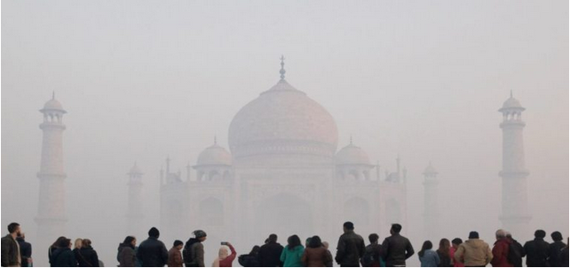
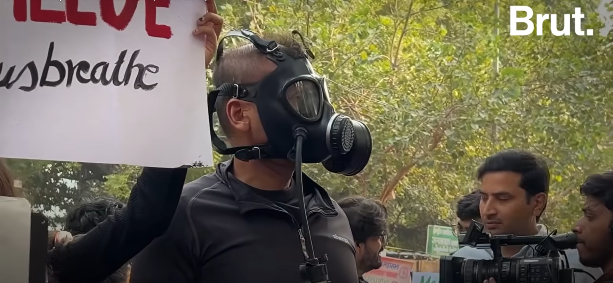
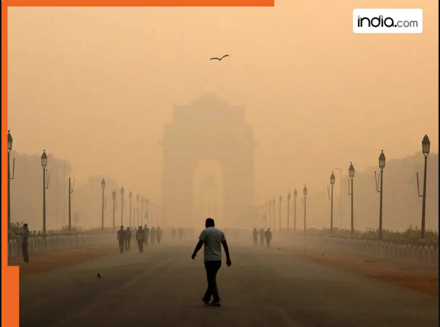

## Pollution in Amritsar: 

- [Reddit: AQI condition worsening in Amritsar](https://www.reddit.com/r/amritsar/comments/1p3jttp/aqi_condition_is_worsening/?utm_source=share&utm_medium=web3x&utm_name=web3xcss&utm_term=1&utm_content=share_button)

## Pollution protests in Delhi:

- [Reddit: Let's create a human chain against politicians and Bureauchrats, fellow Indians](https://www.reddit.com/r/CleanAirForDelhi/comments/1p3fz8r/lets_create_a_human_chain_against_politicians_and/)

- [Reddit: They are detaining people](https://www.reddit.com/r/delhi/comments/1osjg99/theyre_detaining_people/?utm_source=share&utm_medium=web3x&utm_name=web3xcss&utm_term=1&utm_content=share_button)

- [Reddit: Join us at Jantar Mantar, Nov 8 2025](https://www.reddit.com/r/delhi/comments/1oo89r0/join_us_on_6th_november_at_jantar_mantar/?utm_source=share&utm_medium=web3x&utm_name=web3xcss&utm_term=1&utm_content=share_button)

## Pollution in India has been persisting from longer than you may think

### Air pollution 1 year ago
[Reddit: China effectively tackling Air pollution, while India continues to choke](https://www.reddit.com/r/india/comments/1gurstd/china_effectively_tackling_air_pollution_while/?utm_source=share&utm_medium=web3x&utm_name=web3xcss&utm_term=1&utm_content=share_button)

### Air pollution 2 years ago (Kolkata?):

[Reddit: India needs to address deteriorating air pollution](https://www.reddit.com/r/india/comments/1aixqzd/india_needs_to_address_the_deteriorating_air/?utm_source=share&utm_medium=web3x&utm_name=web3xcss&utm_term=1&utm_content=share_button)

### Air pollution 8 years ago, 2017: 

[Youtube(NDTV): 5 Lakh Deaths In 2015: Is India Losing The Battle Against Pollution?](https://youtu.be/cYrN9PZU4pY?si=49PWeqHAhgPyB_Sr)

### Air pollution 12 years ago, Sep 2 2013:

[Times of India: Indians have 30% weaker lungs than Europeans](https://timesofindia.indiatimes.com/home/science/Indians-have-30-weaker-lungs-than-Europeans-Study/articleshow/22217540.cms)